# FamilyFund 家庭基金管理系统 — 架构设计文档

> **版本**: v1.0  
> **作者**: Family CIO  
> **创建日期**: 2026-04-07  
> **状态**: 活跃迭代中

---

## 目录

- [第一部分：当前系统设计](#第一部分当前系统设计)
  - [1. 项目概述与设计哲学](#1-项目概述与设计哲学)
  - [2. 系统架构总览](#2-系统架构总览)
  - [3. 数据契约](#3-数据契约)
  - [4. 核心算法详解](#4-核心算法详解)
  - [5. CIO 工作流](#5-cio-工作流)
  - [6. 目录结构](#6-目录结构)
  - [6.5 统一资产管理系统（已实现）](#65-统一资产管理系统已实现)
- [第二部分：未来演进蓝图](#第二部分未来演进蓝图)
  - [7. 分层架构演进](#7-分层架构演进)
  - [8. 模块化扩展设计](#8-模块化扩展设计)
  - [9. 可视化与报表升级](#9-可视化与报表升级)
  - [10. 数据安全与备份策略](#10-数据安全与备份策略)
  - [11. 技术选型路线图](#11-技术选型路线图)
- [第三部分：附录](#第三部分附录)
  - [12. 术语表](#12-术语表)
  - [13. 参考资料](#13-参考资料)

---

# 第一部分：当前系统设计

## 1. 项目概述与设计哲学

### 1.1 项目定位

FamilyFund 是一套**本地化的家庭基金管理系统**，用于将家庭全部资产视为一支"虚拟基金"进行净值化管理。系统采用公募基金标准的**份额-净值核算模型**，精确剔除外部资金进出对投资收益的干扰，真实反映家庭资产管理的投资回报能力。

### 1.2 设计哲学

本系统遵循以下核心原则：

| 原则 | 阐释 |
|:---|:---|
| **如无必要，勿增实体** | 家庭财务数据量极小（每周一条，十年仅 520 条），不引入数据库，直接使用 CSV 纯文本存储 |
| **反脆弱性** | CSV 是人类可读的纯文本格式，不依赖任何特定软件；即使 Python 生态变迁，数据依然可用 Excel/Numbers/记事本打开 |
| **数据主权** | 所有财务数据存储在本地物理硬盘或私有云盘，不依赖任何第三方 SaaS 服务，实现对数据隐私和计算逻辑的绝对掌控 |
| **便携性优先** | 配合 Git 版本控制或 iCloud/OneDrive 同步，实现跨设备访问与历史追溯 |
| **CIO 视角** | 系统面向家庭首席投资官（CIO），提供的是投资决策所需的核心指标，而非记账流水 |

### 1.3 与传统记账软件的本质区别

```
传统记账软件：记录"钱花在哪了"  → 消费维度
FamilyFund：   衡量"钱管得怎样"  → 投资维度
```

FamilyFund 不关心每一笔消费明细，只关心：**在剔除所有外部资金进出后，你的资产增值了多少？** 这正是公募基金用"单位净值"回答的核心问题。

---

## 2. 系统架构总览

### 2.1 分层架构图

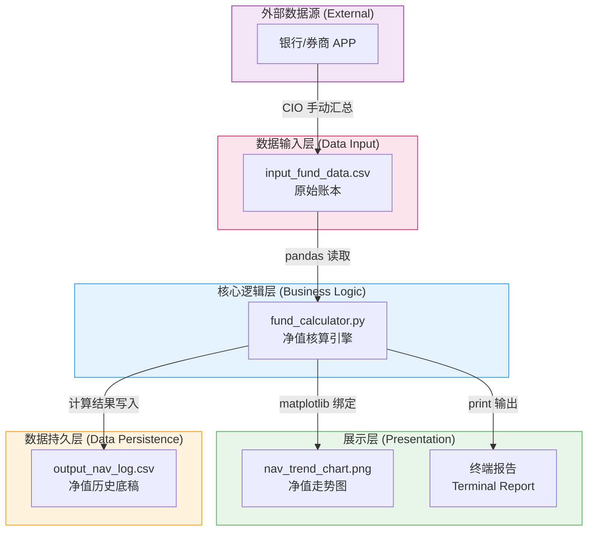

### 2.2 组件交互流

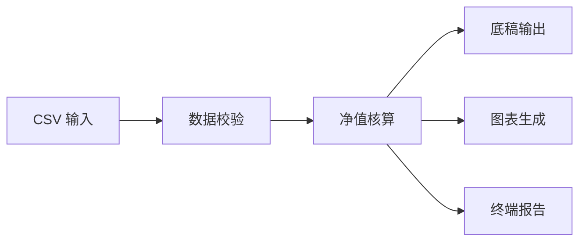

### 2.3 技术栈

| 层级 | 技术选型 | 职责 |
|:---|:---|:---|
| 运行环境 | Python 3.x | 脚本执行 |
| 数据处理 | pandas | CSV 读写、数据帧运算 |
| 可视化 | matplotlib | 静态图表生成 |
| 数据存储 | CSV (纯文本) | 输入输出持久化 |
| 版本控制 | Git (可选) | 数据变更追踪 |

---

## 3. 数据契约

### 3.1 输入文件：`input_fund_data.csv`

这是 CIO 唯一需要手动维护的文件，记录每个统计周期的资产快照。

#### Schema 定义

| 字段名 | 数据类型 | 必填 | 约束条件 | 说明 |
|:---|:---|:---|:---|:---|
| `Date` | `string` (ISO 8601) | 是 | 格式 `YYYY-MM-DD`，严格递增 | 对账日期 |
| `Total_Market_Value` | `float` | 是 | > 0 | 对账日的资产总市值（已包含当日资金进出） |
| `Net_Cash_Flow` | `float` | 是 | 无限制（正/负/零） | 本期外部资金变动：投入为正，提取为负，无变动为 0 |

#### 业务规则

1. **建仓日约束**：第一行（index=0）必须满足 `Total_Market_Value == Net_Cash_Flow`，用于锚定初始净值为 1.0000
2. **日期单调性**：`Date` 列必须严格递增，不允许重复或乱序
3. **市值含义**：`Total_Market_Value` 是**含当日资金进出后**的总市值快照
4. **现金流方向**：
   - 正数 → 外部资金注入（如收到奖金 100,000 入账）
   - 负数 → 外部资金提取（如提取 30,000 用于消费）
   - 零 → 本期无外部资金变动

#### 示例数据

```csv
Date,Total_Market_Value,Net_Cash_Flow
2024-04-01,500000,500000
2024-04-08,510000,0
2024-04-15,620000,100000
2024-04-22,600000,-30000
```

### 3.2 输出文件：`output_nav_log.csv`

由程序自动生成的完整财务底稿，每次运行会覆盖写入。

#### Schema 定义

| 字段名 | 数据类型 | 说明 |
|:---|:---|:---|
| `Date` | `string` | 对账日期（来自输入） |
| `Total_Market_Value` | `float` | 资产总市值（来自输入） |
| `Net_Cash_Flow` | `float` | 净现金流（来自输入） |
| `NAV` | `float` (4 位小数) | 单位净值 — 核心指标 |
| `Total_Shares` | `float` (2 位小数) | 累计总份额 |
| `Cumulative_Return(%)` | `float` (2 位百分比) | 累计收益率 = (NAV - 1) × 100 |

---

## 4. 核心算法详解

### 4.1 基金核算模型

FamilyFund 采用的是公募基金行业标准的**"份额净值法"**。核心思想：

> **资金的进出只改变份额数量，不影响单位净值。净值只反映资产管理的真实回报能力。**

### 4.2 数学公式

对于第 `t` 期（`t ≥ 1`）：

```
1. 剥离资金流后的真实市值:
   V_real(t) = Total_Market_Value(t) - Net_Cash_Flow(t)

2. 计算当期单位净值:
   NAV(t) = V_real(t) / Total_Shares(t-1)

3. 计算本次资金进出带来的份额变动:
   ΔShares(t) = Net_Cash_Flow(t) / NAV(t)

4. 更新累计总份额:
   Total_Shares(t) = Total_Shares(t-1) + ΔShares(t)

5. 累计收益率:
   Cumulative_Return(t) = NAV(t) - 1.0
```

对于建仓日（`t = 0`）：

```
NAV(0) = 1.0000  (锚定基准)
Total_Shares(0) = Total_Market_Value(0) / NAV(0)
```

### 4.3 算法流程图

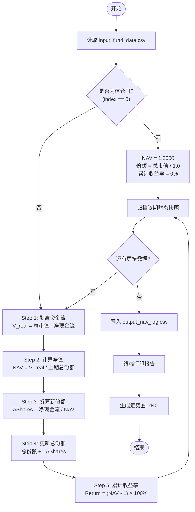

### 4.4 算例推演

以示例数据为例，逐步推算：

| 期次 | 日期 | 总市值 | 净现金流 | 剥离后市值 | NAV | ΔShares | 累计份额 | 收益率 |
|:---:|:---|---:|---:|---:|:---:|---:|---:|:---:|
| 0 | 2024-04-01 | 500,000 | 500,000 | — | 1.0000 | — | 500,000 | 0.00% |
| 1 | 2024-04-08 | 510,000 | 0 | 510,000 | 1.0200 | 0 | 500,000 | 2.00% |
| 2 | 2024-04-15 | 620,000 | 100,000 | 520,000 | 1.0400 | 96,153.85 | 596,153.85 | 4.00% |
| 3 | 2024-04-22 | 600,000 | -30,000 | 630,000 | 1.0568 | -28,387.10 | 567,766.75 | 5.68% |

**解读**：尽管第 2 期总市值从 365 万跳到 385 万（看似暴涨），但其中 10 万是外部注入资金，实际投资收益仅使净值从 1.0200 升至 1.0400。**这就是净值法的价值 — 它诚实地剥离了"假增长"。**

---

## 5. CIO 工作流

### 5.1 每周对账流程

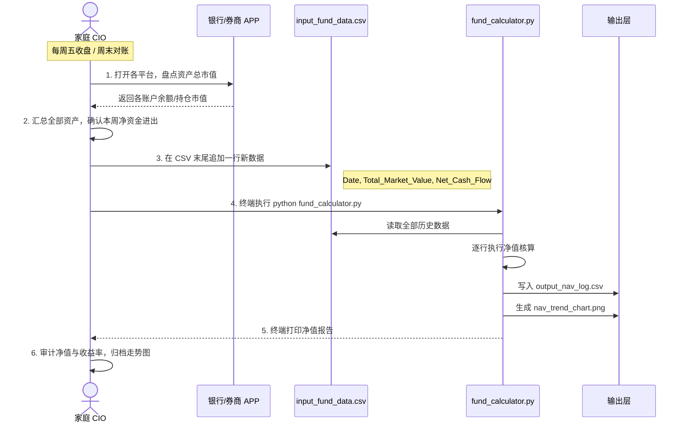

### 5.2 操作清单

| 步骤 | 操作 | 耗时估算 | 频率 |
|:---:|:---|:---|:---|
| 1 | 打开银行/券商 APP，汇总各账户市值 | 5-10 分钟 | 每周 |
| 2 | 确认本周是否有外部资金进出 | 1 分钟 | 每周 |
| 3 | 在 CSV 文件中追加一行数据 | 1 分钟 | 每周 |
| 4 | 终端运行 `python fund_calculator.py` | < 1 秒 | 每周 |
| 5 | 审计终端报告和走势图 | 2 分钟 | 每周 |

> **总计：每周仅需约 10-15 分钟，即可完成一次完整的家庭基金净值核算。**

---

## 6. 目录结构

### 6.1 当前结构

```
FamilyFund/
├── instruction.md                  # 项目说明文档（原始需求）
├── ARCHITECTURE.md                 # 架构设计文档（本文档）
├── CurrentAsset.xlsx               # [历史] CIO 原始 Excel 资产表
├── requirements.txt                # Python 依赖声明
│
├── data/                           # 数据层
│   ├── portfolio.csv               # [手动维护] ★ 统一资产账本（唯一输入）
│   ├── portfolio_sample.csv        # 示例数据（3 周 × 9 持仓）
│   ├── input_fund_data.csv         # [历史] 旧版基金账本
│   ├── output_fund_nav.csv         # [程序生成] 基金整体净值底稿
│   ├── output_class_nav.csv        # [程序生成] 分类净值底稿
│   ├── output_allocation.csv       # [程序生成] 资产配置快照
│   ├── output_nav_log.csv          # [程序生成] 旧版净值底稿
│   ├── output_asset_breakdown.csv  # [程序生成] 逐笔持仓明细
│   ├── output_asset_summary.csv    # [程序生成] 资产类别汇总
│   ├── own_sap.csv                 # [手动/UI 维护] Own SAP (ESPP) 交易记录
│   └── move_sap.csv                # [手动/UI 维护] Move SAP (RSU) 交易记录
│
├── src/                            # 核心逻辑层
│   ├── nav_engine.py               # ★ 统一多级净值核算引擎
│   ├── sap_stock.py                # SAP 股票成本核算引擎
│   ├── import_sap_xlsx.py          # XLSX → own_sap/move_sap CSV 迁移工具
│   ├── fx_service.py               # 实时汇率获取（frankfurter.app）
│   ├── migrate_xlsx.py             # XLSX → portfolio.csv 迁移工具
│   ├── fund_calculator.py          # [历史] 旧版净值核算
│   └── asset_breakdown.py          # XLSX 资产配置解析
│
├── dashboard/                      # ★ 可视化仪表板
│   └── app.py                      # Streamlit + Plotly 交互式仪表板
│
├── output/                         # 展示层（静态图表）
│   ├── fund_nav_trend.png          # 基金整体净值走势图
│   ├── class_nav_trend.png         # 分类净值对比图
│   ├── asset_allocation.png        # 资产配置饼图
│   └── nav_trend_chart.png         # [历史] 旧版净值走势图
│
└── tests/                          # 测试（共 98 项）
    ├── test_nav_engine.py          # 统一引擎测试（32 项）
    ├── test_sap_stock.py           # SAP 股票测试（22 项）
    ├── test_fund_calculator.py     # 旧版净值测试（16 项）
    └── test_asset_breakdown.py     # 资产配置测试（20 项）
```

### 6.2 文件职责矩阵

| 文件 | 维护方 | 读写模式 | 版本控制 |
|:---|:---|:---|:---|
| `portfolio.csv` | CIO 手动 | 每周追加行 | **必须纳入 Git** |
| `portfolio_sample.csv` | 示例数据 | 只读参考 | 纳入 Git |
| `input_fund_data.csv` | 历史数据 | 已归档 | 纳入 Git |
| `CurrentAsset.xlsx` | 历史数据 | 已归档 | 可选 |
| `nav_engine.py` | 开发维护 | 按需修改 | 必须纳入 Git |
| `sap_stock.py` | 开发维护 | 按需修改 | 纳入 Git |
| `import_sap_xlsx.py` | 开发维护 | 一次性工具 | 纳入 Git |
| `fx_service.py` | 开发维护 | 按需修改 | 纳入 Git |
| `own_sap.csv` | CIO/UI | 追加行 | **不纳入 Git**（私人数据） |
| `move_sap.csv` | CIO/UI | 追加行 | **不纳入 Git**（私人数据） |
| `dashboard/app.py` | 开发维护 | 按需修改 | 纳入 Git |
| `migrate_xlsx.py` | 开发维护 | 一次性工具 | 纳入 Git |
| `fund_calculator.py` | 历史代码 | 已归档 | 纳入 Git |
| `asset_breakdown.py` | 开发维护 | 按需修改 | 纳入 Git |
| `output_*.csv` | 程序自动 | 每次全量覆盖 | 可选（可重新生成） |
| `*.png` 图表 | 程序自动 | 每次覆盖 | 不建议（二进制文件） |

---

## 6.5 统一资产管理系统（已实现）

> **这是当前推荐的工作模式。** 旧版 `fund_calculator.py` + `CurrentAsset.xlsx` 流程已被以下统一系统替代。

### 6.5.1 设计动机

旧系统存在三个问题：
1. **重复劳动** — CIO 需同时维护 `CurrentAsset.xlsx` 和 `input_fund_data.csv`
2. **无交叉校验** — 两个文件之间没有数据一致性检查
3. **无分类净值** — 只能看到基金整体收益，无法比较各资产类别的投资表现

统一系统用**一个 CSV 文件**（`portfolio.csv`）替代两个输入，并在此基础上实现多级净值核算。

### 6.5.2 统一输入：`portfolio.csv`

每行代表一个持仓在某一日期的快照，所有持仓按周排列：

```csv
Date,Asset_Class,Platform,Name,Code,Currency,Exchange_Rate,Shares,Current_Price,Total_Value,Net_Cash_Flow
2024-04-01,ETF_Stock,券商A,沪深300ETF,510300,CNY,1.0,5000,4.10,20500.00,20500.00
2024-04-01,Company_Stock,海外券商,AAPL,AAPL,USD,7.25,50,170.50,61806.25,61806.25
2024-04-01,Cash,银行A,现金,,CNY,1.0,50000,1,50000,50000
2024-04-08,ETF_Stock,券商A,沪深300ETF,510300,CNY,1.0,5000,4.25,21250.00,0
2024-04-08,Company_Stock,海外券商,AAPL,AAPL,USD,7.28,50,172.00,62588.00,0
2024-04-08,Cash,银行A,现金,,CNY,1.0,50000,1,50000,0
```

#### 字段定义

| 字段 | 类型 | 必填 | 说明 |
|:---|:---|:---|:---|
| `Date` | YYYY-MM-DD | 是 | 对账日期，严格递增 |
| `Asset_Class` | string | 是 | 资产类别（7 选 1，见下表） |
| `Platform` | string | 是 | 交易平台/账户名 |
| `Name` | string | 是 | 持仓名称 |
| `Code` | string | 否 | 证券代码/基金代码 |
| `Currency` | string | 是 | 币种（CNY/HKD/USD/EUR） |
| `Exchange_Rate` | float | 是 | 该币种→CNY 汇率（CNY=1.0，USD≈7.25） |
| `Shares` | float | 是 | 持有份额/股数 |
| `Current_Price` | float | 是 | 当前单价（原始币种） |
| `Total_Value` | float | 是 | 当前总市值（CNY），= Shares × Price × Exchange_Rate |
| `Net_Cash_Flow` | float | 是 | 本期外部资金变动。建仓日 = Total_Value，正常周 = 0。特殊情况：现金存取 → Cash 行 NCF；SAP Own SAP 归属 → Company_Stock 行 NCF = 归属成本（Cost_CNY）；SAP Move SAP 归属 → NCF = 0（免费获得）；内部调仓 → NCF = 0 |

#### 资产类别

| 代码 | 中文名 | 典型持仓 |
|:---|:---|:---|
| `US_Index_Fund` | 美股指数基金 | 标普 500 QDII、纳指 QDII 等 |
| `CN_Index_Fund` | A股指数基金 | 沪深 300、中证 500 等宽基指数 |
| `ETF_Stock` | ETF与股票 | 红利 ETF、个股等 |
| `Fixed_Income` | 固定收益 | 银行理财、短债基金等 |
| `Gold` | 黄金 | 实物黄金、纸黄金、黄金 ETF |
| `Company_Stock` | 公司股票 | 雇主公司股票等 |
| `Cash` | 现金 | 各银行活期余额 |

### 6.5.3 多级净值核算

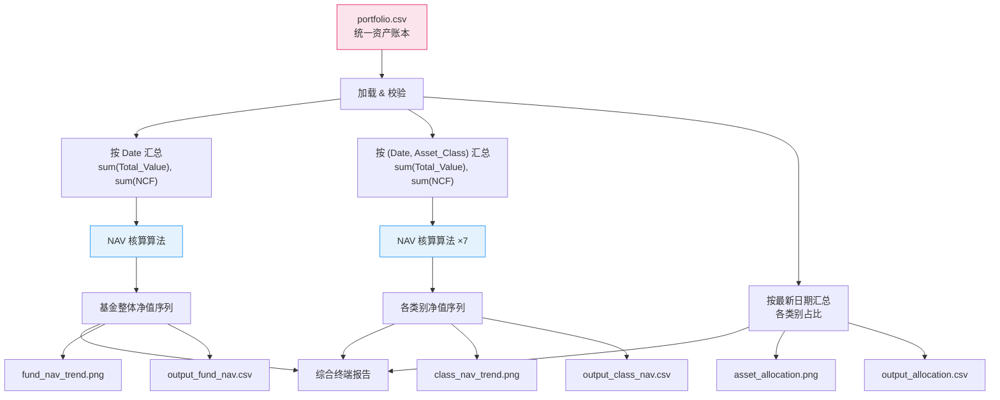

**核心算法完全复用**：`_run_nav_calculation()` 是同一个函数，在基金整体和每个资产类别各跑一次。算法逻辑与原始 `fund_calculator.py` 完全一致（份额净值法）。

### 6.5.4 新版 CIO 工作流

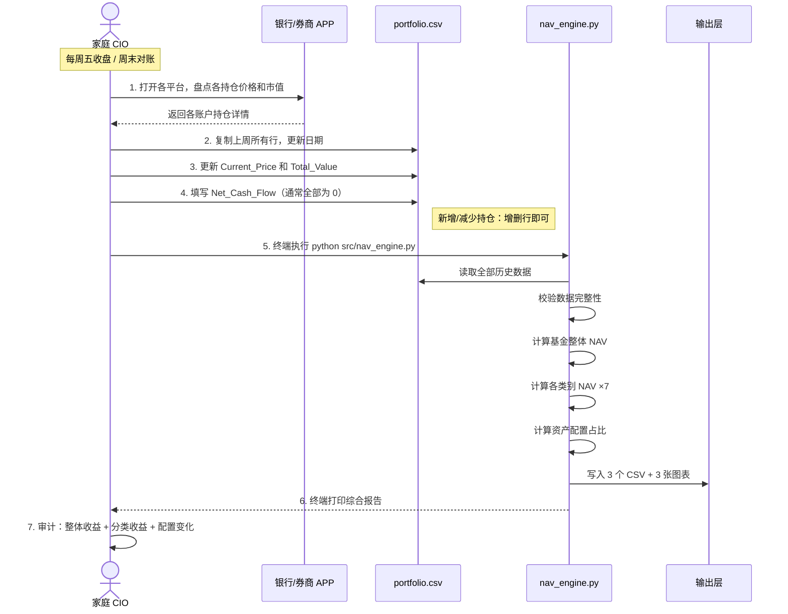

### 6.5.5 运行方式

```bash
# 常规运行（读取 data/portfolio.csv）
python src/nav_engine.py

# 指定输入文件
python src/nav_engine.py data/portfolio_sample.csv

# 从 XLSX 迁移（一次性）
python src/migrate_xlsx.py
```

### 6.5.6 输出产物

| 文件 | 内容 |
|:---|:---|
| `data/output_fund_nav.csv` | 基金整体净值时间序列（Date, NAV, Total_Shares, Cumulative_Return） |
| `data/output_class_nav.csv` | 各类别净值时间序列（含 Asset_Class 列） |
| `data/output_allocation.csv` | 最新日期的资产配置占比 |
| `output/fund_nav_trend.png` | 基金整体净值走势图 |
| `output/class_nav_trend.png` | 7 条线的分类净值对比图 |
| `output/asset_allocation.png` | 甜甜圈配置饼图 |

### 6.5.7 SAP 股票工作流

SAP 公司股票由两个独立计划组成，各有独立的 CSV 和录入流程。SAP Stock tab 的价格和汇率由用户手动输入，**不依赖 portfolio.csv**。

#### Monthly — Own SAP (ESPP)

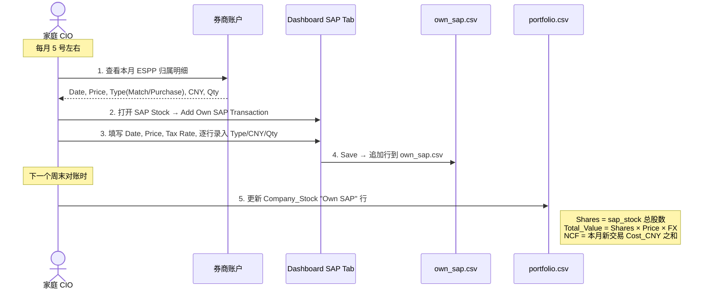

#### Quarterly — Move SAP (RSU)

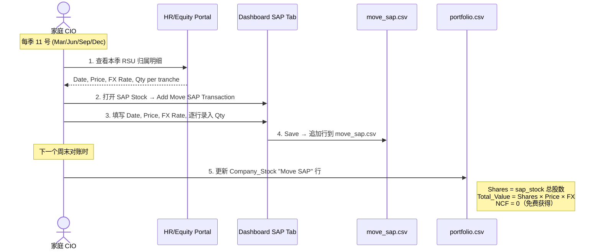

#### Annual — Dividends (~May)

两个计划的分红均以股票形式再投资。收到分红后：
1. 在 SAP Stock tab 添加 Dividend 交易（Date, Price, Qty）
2. 下次对账：更新对应 Company_Stock 行的 Shares 和 Total_Value
3. Own SAP Dividend: NCF = Cost_CNY（全额成本）; Move SAP Dividend: NCF = 0

---

# 第二部分：未来演进蓝图

## 7. 分层架构演进

### 7.1 目标架构

随着需求增长，系统将从"单脚本"逐步演进为分层模块化架构：

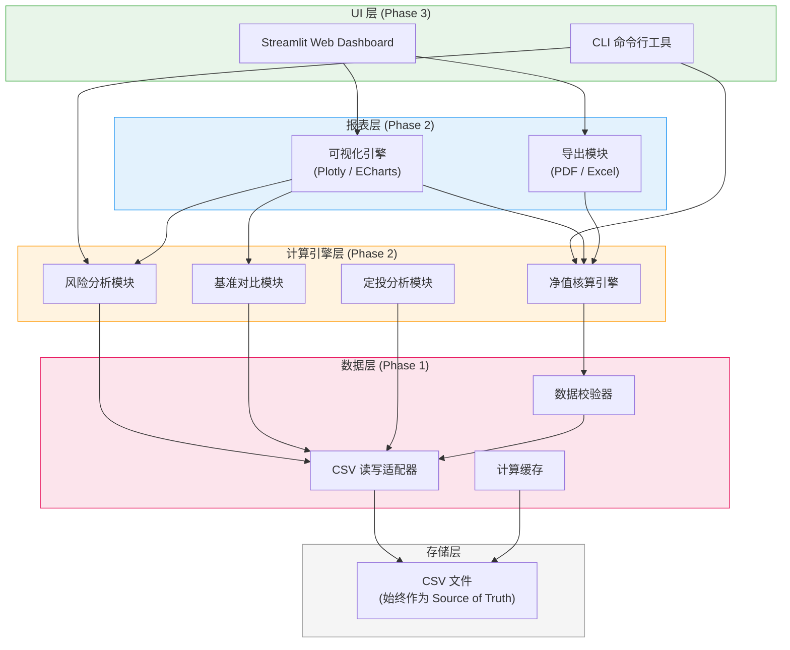

### 7.2 演进原则

1. **CSV 永远是 Source of Truth** — 无论架构如何演进，所有原始数据始终存储在 CSV 中，任何上层模块都通过数据层访问
2. **向后兼容** — 新版本程序必须能正确读取旧版本 CSV 格式
3. **模块可插拔** — 每个扩展模块（风险分析、基准对比等）都是独立的，可以按需启用
4. **渐进式增强** — 每个 Phase 都是上一个的超集，不需要推翻重来

---

## 8. 模块化扩展设计

### 8.1 多资产类别追踪（已实现）

#### 概述

资产配置追踪工具 `asset_breakdown.py` 可直接解析 CIO 维护的 `CurrentAsset.xlsx` 工作表，自动识别分区、分类持仓、生成结构化报告。

#### 数据源与解析策略

输入文件 `CurrentAsset.xlsx` 采用分区式布局，每个分区代表一个交易平台/账户：

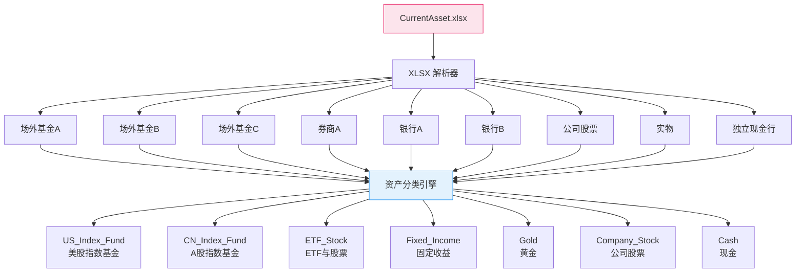

#### 分区解析规则

XLSX 中每个分区遵循固定模式：

```
[分区标题行] — col A 有值，其余为空（如"场外基金A"、"券商A"）
[列标题行]   — col A 为"基金公司"或"标的"
[数据行 ×N]  — 各持仓明细
[空行]
[小计行]     — col A 为空，总成本/当前金额/总金额有汇总数值
```

解析器通过以下逻辑逐行处理：
1. 单值行 → 识别为分区标题，更新 `current_section`
2. col A 为"基金公司/标的" → 跳过列标题
3. col A 有值且有财务数据 → 提取为持仓记录
4. col A 为空 → 跳过（小计行/空行）
5. 特殊行（汇率、独立现金）→ 单独处理

#### 资产分类映射

分类采用两级匹配策略：

**第一级：持仓名称覆写**（优先级最高）

| 持仓名称 | 强制分类 | 原因 |
|:---|:---|:---|
| 现金 | `Cash` | 券商内的现金余额 |
| 国债ETF / 短融ETF | `Fixed_Income` | 虽在券商分区但本质是债券 |
| 黄金 | `Gold` | 跨平台统一归类（银行+实物） |
| 现金（银行X）/ 现金（银行Y） | `Cash` | 独立现金行 |

**第二级：分区默认映射**

| 分区 | 默认资产类别 |
|:---|:---|
| 场外基金A、场外基金B | `US_Index_Fund` |
| 场外基金C | `CN_Index_Fund` |
| 券商A | `ETF_Stock` |
| 银行A、银行B | `Fixed_Income` |
| 公司股票 | `Company_Stock` |
| 实物 | `Gold` |

#### 输出产物

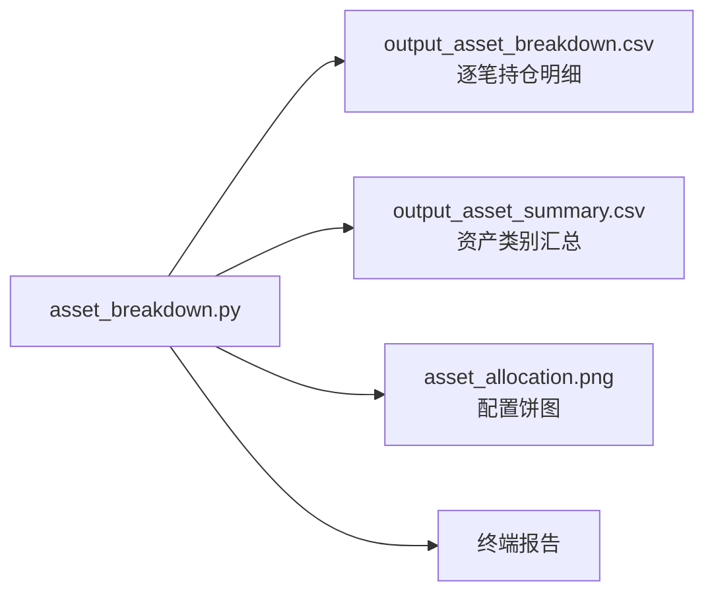

**逐笔持仓明细 CSV (`output_asset_breakdown.csv`)**

| 字段 | 类型 | 说明 |
|:---|:---|:---|
| `Asset_Class` | string | 资产类别代码 |
| `Platform` | string | 来源分区（券商A、银行A等） |
| `Name` | string | 持仓名称 |
| `Code` | string | 证券代码/基金代码 |
| `Cost_Price` | float | 成本价 |
| `Current_Price` | float | 当前价/净值 |
| `Shares` | float | 持有份额/股数 |
| `Total_Cost` | float | 总成本 |
| `Current_Value` | float | 当前金额 |
| `Pending_Amount` | float | 待确认金额 |
| `Total_Value` | float | 总金额（含待确认） |
| `PnL_Amount` | float | 浮盈/浮亏金额 |
| `PnL_Percent` | float | 浮盈/浮亏比例 |

**资产类别汇总 CSV (`output_asset_summary.csv`)**

| 字段 | 类型 | 说明 |
|:---|:---|:---|
| `Asset_Class` | string | 类别代码 |
| `Display_Name` | string | 中文显示名 |
| `Total_Cost` | float | 类别总成本 |
| `Total_Value` | float | 类别总市值 |
| `PnL_Amount` | float | 类别盈亏 |
| `PnL_Percent` | float | 类别盈亏比例 |
| `Allocation_Percent` | float | 占总资产比例 |

#### 运行方式

```bash
python src/asset_breakdown.py
```

输出：终端配置报告 + `data/output_asset_breakdown.csv` + `data/output_asset_summary.csv` + `output/asset_allocation.png`

### 8.2 基准对比

#### 设计思路

将家庭基金的净值走势与一个或多个市场基准指数进行对比，量化超额收益（Alpha）。

#### 支持的基准

| 基准 | 代码 | 数据来源 |
|:---|:---|:---|
| 沪深 300 | `CSI300` | AKShare / Tushare API |
| 标普 500 | `SP500` | yfinance API |
| 万得全A | `WINDA` | AKShare |
| 自定义复合基准 | `CUSTOM` | 用户手动输入 CSV |

#### 输出指标

- **超额收益率** = 家庭基金收益率 - 基准收益率
- **相对走势图**：将家庭基金与基准的净值走势叠加在同一张图上

### 8.3 风险分析指标

#### 核心指标矩阵

| 指标 | 公式简述 | 意义 |
|:---|:---|:---|
| **年化收益率** | 将累计收益折算到年度 | 标准化的回报度量 |
| **年化波动率** | 周收益率标准差 × √52 | 风险大小的度量 |
| **夏普比率** | (年化收益 - 无风险利率) / 年化波动率 | 每单位风险的超额回报 |
| **最大回撤** | 峰值到谷值的最大下跌幅度 | 最坏情况的损失幅度 |
| **卡尔马比率** | 年化收益 / 最大回撤 | 收益与极端风险的比值 |

#### 计算流程

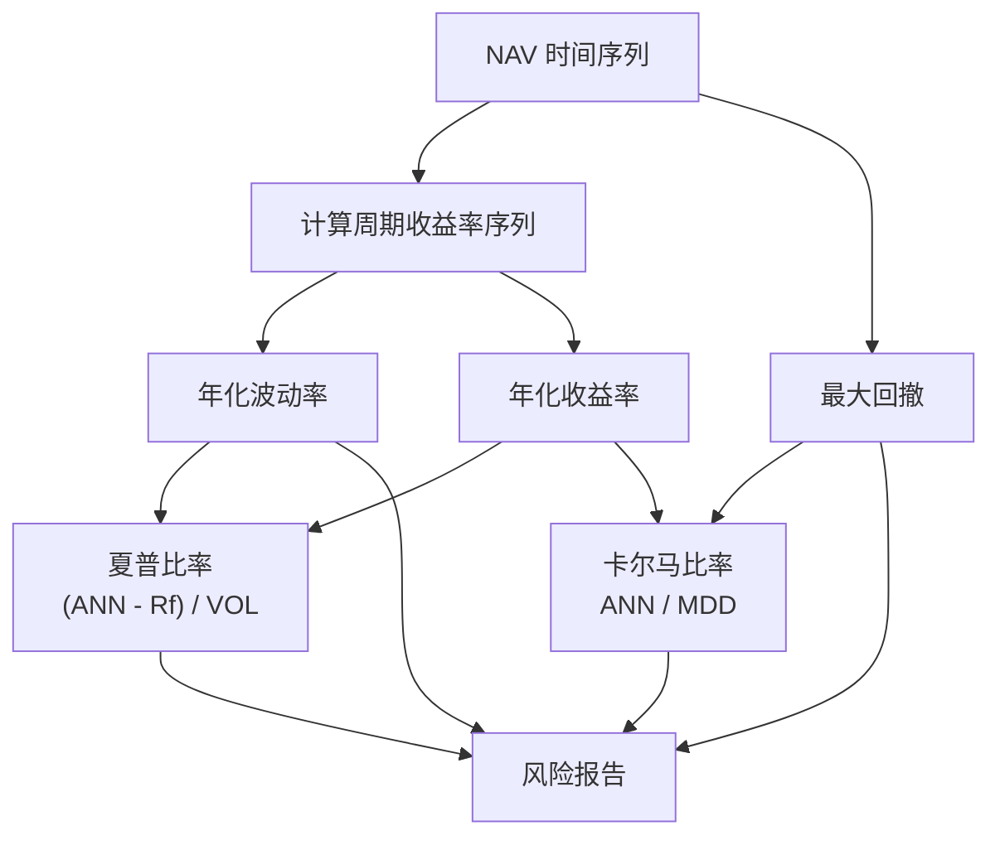

### 8.4 定投/收益分析

#### XIRR（扩展内部收益率）

XIRR 是衡量不等额、不等间隔投资回报的黄金标准。通过将每一笔现金流（包括最终市值作为终值）纳入计算，得出真实的年化回报率。

#### 设计方案

- 利用 `scipy.optimize` 求解 XIRR 方程
- 输入数据直接复用 `input_fund_data.csv` 中的 `Net_Cash_Flow` 列
- 最后一行的 `Total_Market_Value` 作为终值现金流（正值）

#### 输出

| 指标 | 说明 |
|:---|:---|
| XIRR | 考虑资金时间价值的真实年化回报率 |
| 资金加权收益 | 考虑投入时机的实际收益 |
| 时间加权收益 | 即当前的 NAV 累计收益率，不受资金进出影响 |

> **XIRR vs NAV**：NAV 回答"你的投资眼光如何"（时间加权），XIRR 回答"你实际赚了多少钱"（资金加权）。二者互补，缺一不可。

---

## 9. 可视化与报表升级

### 9.1 演进路径


> **全部三个阶段已实现。** Phase 1 保留在 `nav_engine.py` 中用于终端 / CI 场景；Phase 2 + 3 合并在 `dashboard/app.py` 中，基于 Streamlit + Plotly 提供交互式仪表板。

### 9.2 Phase 1 — matplotlib 静态图（已实现）

- `nav_engine.py` 中的 `plot_fund_nav()`、`plot_class_nav()`、`plot_allocation_pie()`
- 输出静态 PNG 到 `output/` 目录
- 适合终端查看、CI 自动化、邮件报告附件

### 9.3 Phase 2+3 — Streamlit + Plotly 仪表板（已实现）

位于 `dashboard/app.py`，单文件约 275 行。启动命令：

```bash
streamlit run dashboard/app.py
```

#### 架构

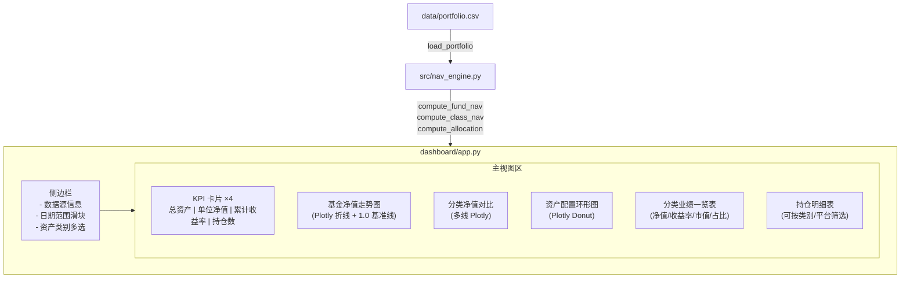

#### 功能清单

| 视图 | 组件 | 交互性 |
|:---|:---|:---|
| **基金总览** | 4 个 KPI 指标卡 + 净值走势折线图 | 悬浮提示、缩放、日期范围联动 |
| **资产类别对比** | 多线净值对比图 + 环形配置图 + 业绩表 | 类别筛选联动、悬浮数据 |
| **持仓明细** | 完整持仓表（st.dataframe） | 类别/平台下拉筛选、列排序 |
| **侧边栏** | 日期范围滑块 + 类别多选 + 全选开关 | 全局联动 |

#### 技术要点

- **`@st.cache_data`**：缓存 CSV 加载与计算结果，避免每次交互重复计算
- **Plotly Express**：所有图表均为交互式（悬浮提示、缩放平移、导出 PNG）
- **数据源自动检测**：优先使用 `data/portfolio.csv`，不存在时回退到 `data/portfolio_sample.csv`
- **纯本地运行**：无需部署服务器，`streamlit run dashboard/app.py` 即可
- **实时刷新**：修改 CSV 后刷新浏览器页面即可看到最新数据

---

## 10. 数据安全与备份策略

### 10.1 分层防护体系

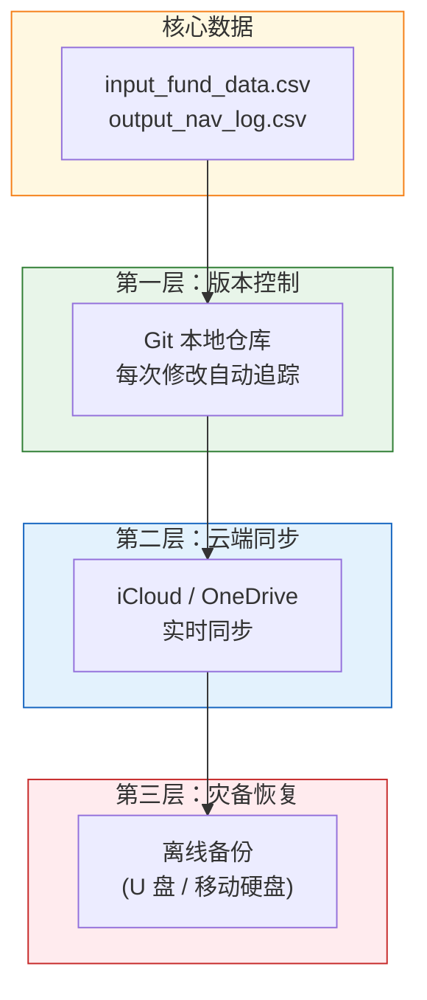

### 10.2 具体策略

| 层级 | 方案 | 频率 | 恢复时间 |
|:---|:---|:---|:---|
| **版本控制** | Git 本地仓库，每次对账后 `git commit` | 每周 | 秒级（`git checkout`） |
| **云端同步** | 项目目录放在 iCloud/OneDrive 同步文件夹 | 实时 | 分钟级（登录云盘下载） |
| **离线备份** | 每季度将整个目录拷贝到 U 盘 | 每季度 | 小时级（物理取出 U 盘） |
| **加密（可选）** | 对 CSV 文件使用 GPG 加密存储 | 按需 | 需要密钥解密 |

### 10.3 Git 工作流建议

```bash
# 每周对账后的标准提交流程
cd FamilyFund
git add data/input_fund_data.csv
git commit -m "weekly: 2024-04-22 NAV 1.0099"

# 运行程序后提交输出
python src/fund_calculator.py
git add data/output_nav_log.csv
git commit -m "calc: 更新净值底稿至 2024-04-22"
```

---

## 11. 技术选型路线图

### 11.1 三阶段演进

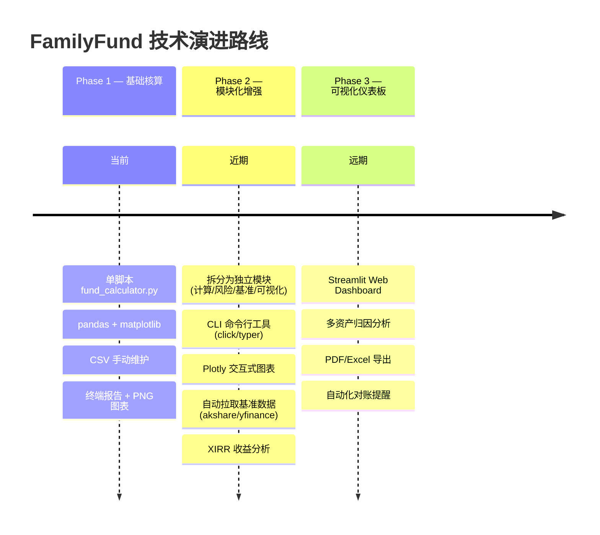

### 11.2 依赖库规划

| Phase | 新增依赖 | 用途 |
|:---|:---|:---|
| 1 | `pandas`, `matplotlib` | 数据处理、静态图表 |
| 2 | `click` 或 `typer` | CLI 框架 |
| 2 | `plotly` | 交互式图表 |
| 2 | `akshare` / `yfinance` | 基准指数数据拉取 |
| 2 | `scipy` | XIRR 求解 |
| 3 | `streamlit` | Web 仪表板 |
| 3 | `openpyxl` / `fpdf2` | Excel/PDF 导出 |

### 11.3 目标目录结构（Phase 2+）

```
FamilyFund/
├── ARCHITECTURE.md
├── README.md
├── requirements.txt
├── pyproject.toml
│
├── data/
│   ├── input_fund_data.csv
│   ├── input_asset_breakdown.csv    # [可选] 资产明细
│   ├── input_benchmark.csv          # [可选] 自定义基准
│   └── output_nav_log.csv
│
├── src/
│   ├── __init__.py
│   ├── cli.py                       # CLI 入口
│   ├── calculator/
│   │   ├── __init__.py
│   │   ├── nav_engine.py            # 净值核算引擎
│   │   ├── risk_metrics.py          # 风险指标计算
│   │   ├── benchmark.py             # 基准对比
│   │   └── xirr.py                  # XIRR 收益分析
│   ├── data/
│   │   ├── __init__.py
│   │   ├── validator.py             # 数据校验器
│   │   └── csv_adapter.py           # CSV 读写适配器
│   └── visualization/
│       ├── __init__.py
│       ├── charts.py                # 图表生成
│       └── report.py                # 报表导出
│
├── dashboard/
│   └── app.py                       # Streamlit 仪表板
│
├── output/
│   ├── nav_trend_chart.png
│   └── report.html
│
└── tests/
    ├── test_nav_engine.py
    ├── test_risk_metrics.py
    └── test_validator.py
```

---

# 第三部分：附录

## 12. 术语表

| 中文术语 | 英文术语 | 缩写 | 定义 |
|:---|:---|:---|:---|
| 单位净值 | Net Asset Value | NAV | 基金每一份额的当前价值，反映真实投资回报 |
| 累计收益率 | Cumulative Return | — | 自建仓以来的总回报比例，= NAV - 1 |
| 总份额 | Total Shares | — | 基金发行的所有份额之和 |
| 净现金流 | Net Cash Flow | NCF | 一个统计周期内的外部资金净变动 |
| 总市值 | Total Market Value | TMV | 所有资产的当期市场价值总和 |
| 年化收益率 | Annualized Return | — | 将任意期限收益折算为等效年度收益 |
| 年化波动率 | Annualized Volatility | — | 收益率的标准差，按年折算后的风险度量 |
| 夏普比率 | Sharpe Ratio | — | 每承受一单位风险所获得的超额回报 |
| 最大回撤 | Maximum Drawdown | MDD | 净值从峰值到谷值的最大跌幅 |
| 卡尔马比率 | Calmar Ratio | — | 年化收益与最大回撤之比 |
| 扩展内部收益率 | Extended Internal Rate of Return | XIRR | 考虑不等额、不等间隔现金流的年化回报率 |
| 时间加权收益 | Time-Weighted Return | TWR | 剔除资金进出影响的纯投资收益，即 NAV 法 |
| 资金加权收益 | Money-Weighted Return | MWR | 考虑资金投入时机的实际收益，即 XIRR 法 |
| 超额收益 | Alpha | α | 基金收益超出基准指数的部分 |
| 资产配置 | Asset Allocation | AA | 资金在不同资产类别间的分布 |
| 收益归因 | Performance Attribution | — | 分析各资产类别对总收益的贡献度 |

## 13. 参考资料

| 资源 | 说明 |
|:---|:---|
| [中国证券投资基金业协会 — 基金净值计算规范](https://www.amac.org.cn) | 公募基金净值核算行业标准 |
| [CFA Institute — Global Investment Performance Standards (GIPS)](https://www.gipsstandards.org) | 全球投资绩效标准 |
| [pandas 官方文档](https://pandas.pydata.org/docs/) | 数据处理核心库 |
| [matplotlib 官方文档](https://matplotlib.org/stable/) | 静态可视化库 |
| [Plotly Python 文档](https://plotly.com/python/) | 交互式可视化库 |
| [Streamlit 官方文档](https://docs.streamlit.io) | Web 仪表板框架 |
| [AKShare 文档](https://akshare.akfamily.xyz) | A 股及金融数据接口 |
| [yfinance 文档](https://github.com/ranaroussi/yfinance) | 海外市场数据接口 |
| [scipy.optimize 文档](https://docs.scipy.org/doc/scipy/reference/optimize.html) | XIRR 数值求解 |

---

> **文档维护说明**：本文档应随系统演进持续更新。每次重大架构变更后，请同步修改对应章节并更新版本号。
